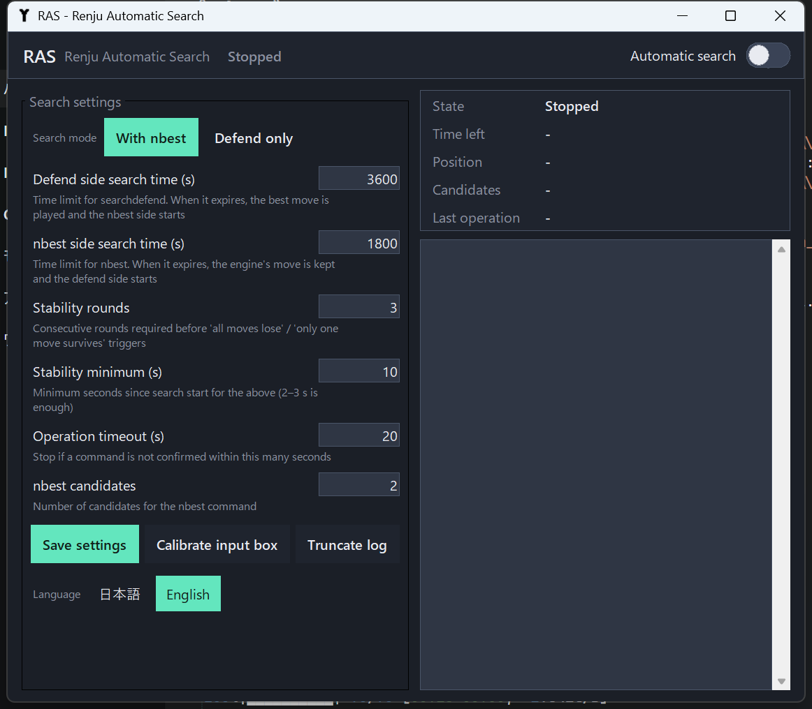

# RAS — Renju Automatic Search

[日本語](#日本語) | [English](#english)



---

## 日本語

**RAS（Renju Automatic Search）は、五目並べ／連珠エンジン Rapfi の GUI「YixinBoard」の探索を、人が付きっきりで操作しなくても自動で進める Windows 用ツールです。**

YixinBoard が出力するデバッグログ（`debuglog.txt`）を読み取って探索状況を判定し、YixinBoard のコマンド入力欄へコマンド（`thinking stop` / `putpos` / `searchdefend` / `nbest`）を送ることで、「探索時間が切れたら最善手を打つ」「全候補が負けなら戻る」「勝ち筋が見つかったら直前の手を戻す」といった手順を自動化します。画像認識は使いません。

### 特徴

- **ログ読み取り方式**：盤面の画像認識ではなく `debuglog.txt` を直接読むため、判定が正確
- **2つの探索モード**：defend探索（`searchdefend`）と nbest探索（`nbest`）を交互に行う「nbest探索あり」、双方 `searchdefend` の「nbest探索なし」
- **読み切りに基づく自動操作**：全候補が `-M` なら2手戻す、`+M` が出たら直前の相手の手を戻す、最善手以外が全て `-M` なら最善手を着手、四への応手は探索せず着手
- **安全設計**：コマンドの受付確認・完了確認・再送、`putpos` の二重チェック、戻しすぎ検知、手動操作の検知（自動探索をオフ）
- **GUI**：探索時間などの設定、自動探索モードのトグル、状態・ログ表示、日本語／英語切替
- 追加ライブラリ不要（Python 標準ライブラリと Windows API のみ）

### 動作環境

- Windows 10 / 11
- YixinBoard（Rapfi エンジン同梱版）
- exe を使う場合は Python 不要。ソースから動かす場合は Python 3.10 以上

### セットアップ

1. YixinBoard を終了した状態で `settings.txt` を開き、`;record debug log` の行の値を `0` から `1` に変更する
2. YixinBoard のフォルダ直下に `RAS` フォルダを作り、`RAS.exe` と `monitor_config.json` を置く（ソースから動かす場合は `src` フォルダをそこに置き `python ras.py`）
3. YixinBoard を起動し、`RAS.exe` を起動する
4. 初回のみ「入力欄を校正」を押し、5秒以内にマウスカーソルを YixinBoard のコマンド入力欄（ログ欄の下のテキスト欄）の上に置く。ウィンドウサイズを変えたら再校正
5. 探索モードと探索時間を設定し、「設定を保存」
6. 「自動探索モード」のトグルをオンにする。探索が止まっていれば `searchdefend` が自動で送られる

止めるときはトグルをオフにします。YixinBoard 側を手動で操作した場合も自動探索モードは自動的にオフになります。

### 自動探索のルール

| 状態 | 条件 | 操作 | 次の状態 |
|---|---|---|---|
| defend探索側 | 探索時間が終了 | 停止 → 最大評価値の手を着手 → `nbest` | nbest探索側 |
| defend探索側 | 全候補が `-M` | 停止 → 停止前より2手短い局面まで戻す → `searchdefend` | defend探索側 |
| defend探索側 | `+M` を検出（直前の nbest 側の手が悪手） | 停止 → 1手戻す → `nbest` | nbest探索側 |
| nbest探索側 | `+M` を検出（直前の defend 側の手が悪手） | 停止 → 1手戻す → `searchdefend` | defend探索側 |
| nbest探索側 | 探索時間が終了 | 停止（エンジンの手が打たれる）→ `searchdefend` | defend探索側 |
| どちらでも | 最善手以外がすべて `-M` | 停止 → 最善手を着手 → 相手側の探索 | 相手側 |
| どちらでも | 相手の四を止めるしかない | 探索せず止め手を着手 | 手番に応じて |

「nbest探索なし」モードでは両側とも `searchdefend` で、探索時間は1つの設定を共用します。

### 設定（`monitor_config.json`）

GUI から編集できます。主な項目：

| 項目 | 既定値 | 説明 |
|---|---|---|
| `a_limit_seconds` | 3600 | defend探索側の探索時間（秒） |
| `b_limit_seconds` | 1800 | nbest探索側の探索時間（秒） |
| `defend_mode_seconds` | 3600 | nbest探索なしモードの探索時間（秒） |
| `stable_rounds` / `stable_seconds` | 3 / 10 | 「全候補が負け」等の安定確認（周回数／最低秒数） |
| `op_timeout_seconds` | 20 | 操作の完了確認を待つ上限秒数 |
| `nbest` | 2 | nbest の候補手数 |
| `search_mode` | `nbest` | `nbest` または `defend` |
| `language` | `ja` | `ja` または `en` |
| `auto_start_search` | true | オン時に探索が止まっていれば `searchdefend` を送る |

### 制限事項

- コマンド送信の瞬間（約0.5秒）は YixinBoard が前面になり、マウスカーソルが動きます（GTK 製の YixinBoard は非アクティブ時のキー入力を受け付けないため）。送信後は元のウィンドウとカーソル位置に戻ります。**送信中はキーボードを触らないでください**（文字が混ざります）
- `debuglog.txt` は探索中に増え続けます（約30MB/時間）。自動探索モードをオンにしたとき 100MB を超えていれば自動で切り詰めます
- 四の判定は簡易実装で、連珠の禁手は考慮していません
- YixinBoard 専用です

### ソースからの実行・ビルド

```
cd src
python ras.py            # GUI
python ras.py --console  # コンソール版（monitor.py --auto 相当）
```

exe のビルド（PyInstaller）：

```
pip install pyinstaller
build.bat
```

`dist\RAS\RAS.exe` が生成されます。

### 構成

| ファイル | 役割 |
|---|---|
| `src/ras.py` | エントリポイント |
| `src/gui.py` | GUI（tkinter） |
| `src/monitor.py` | ログ監視・判定・操作の計画 |
| `src/sender.py` | YixinBoard のコマンド入力欄へのキー送信（user32） |
| `src/parse_debuglog.py` | `debuglog.txt` の解析 |
| `src/i18n.py` | 日本語／英語の文言 |
| `docs/design_ja.txt` | 設計メモ（日本語） |
| `docs/article_ja.md` | 解説記事（日本語） |

---

## English

**RAS (Renju Automatic Search) is a Windows tool that keeps the search of Rapfi — a Gomoku/Renju engine — running inside its GUI YixinBoard without a human at the keyboard.**

It reads YixinBoard's debug log (`debuglog.txt`) to see the search state, and sends commands (`thinking stop` / `putpos` / `searchdefend` / `nbest`) to YixinBoard's command box. When the search time is up it plays the best move; when every move loses it undoes; when a forced win appears it undoes the opponent's last move. No image recognition is involved.

### Features

- **Log based** — reads `debuglog.txt` directly instead of recognising the board image, so the judgement is exact
- **Two search modes** — "with nbest" alternates defend search (`searchdefend`) and nbest search (`nbest`); "defend only" uses `searchdefend` for both sides
- **Automatic operations driven by proven results** — undo two moves when every move is `-M`, undo the opponent's last move when `+M` appears, play the only surviving move, answer a four without searching
- **Safety** — command acknowledgement / completion checks and resend, double checks before `putpos`, undo-overshoot detection, manual-operation detection (turns automatic search off)
- **GUI** — search-time settings, on/off toggle, state and log view, Japanese/English
- No third-party libraries (Python standard library + Windows API)

### Requirements

- Windows 10 / 11
- YixinBoard (with the Rapfi engine)
- The exe needs no Python. Running from source needs Python 3.10+

### Setup

1. With YixinBoard closed, open `settings.txt` and change the `;record debug log` value from `0` to `1`
2. Create a `RAS` folder directly under the YixinBoard folder and put `RAS.exe` and `monitor_config.json` there (from source: put the `src` folder there and run `python ras.py`)
3. Start YixinBoard, then start `RAS.exe`
4. First time only: press **Calibrate input box** and, within 5 seconds, move the mouse over YixinBoard's command box (the text box under the log). Recalibrate if you resize the window
5. Choose the search mode and times, press **Save settings**
6. Turn on **Automatic search**. If no search is running, `searchdefend` is sent automatically

Turn the toggle off to stop. Any manual command in YixinBoard also turns automatic search off.

### Rules

| State | Condition | Operation | Next |
|---|---|---|---|
| defend side | time is up | stop → play best move → `nbest` | nbest side |
| defend side | every move is `-M` | stop → undo to two moves before → `searchdefend` | defend side |
| defend side | `+M` found (nbest side's last move was a blunder) | stop → undo one → `nbest` | nbest side |
| nbest side | `+M` found (defend side's last move was a blunder) | stop → undo one → `searchdefend` | defend side |
| nbest side | time is up | stop (engine's move is played) → `searchdefend` | defend side |
| either | only one move survives | stop → play it → other side's search | other side |
| either | must block a four | play the block without searching | by turn |

In "defend only" mode both sides use `searchdefend` with a single time setting.

### Settings (`monitor_config.json`)

Editable from the GUI. Main keys: `a_limit_seconds`, `b_limit_seconds`, `defend_mode_seconds`, `stable_rounds`, `stable_seconds`, `op_timeout_seconds`, `nbest`, `search_mode` (`nbest`/`defend`), `language` (`ja`/`en`), `auto_start_search`.

### Limitations

- For about 0.5 s per command YixinBoard is brought to the front and the mouse moves (GTK apps ignore key input while inactive). Focus and cursor are restored afterwards. **Do not type while a command is being sent**
- `debuglog.txt` grows (~30 MB/h). It is truncated automatically when automatic search is turned on and the file exceeds 100 MB
- Four detection is simple and ignores Renju forbidden moves
- YixinBoard only

### Run / build from source

```
cd src
python ras.py            # GUI
python ras.py --console  # console mode
```

Build the exe with PyInstaller: `pip install pyinstaller` then `build.bat` → `dist\RAS\RAS.exe`.
